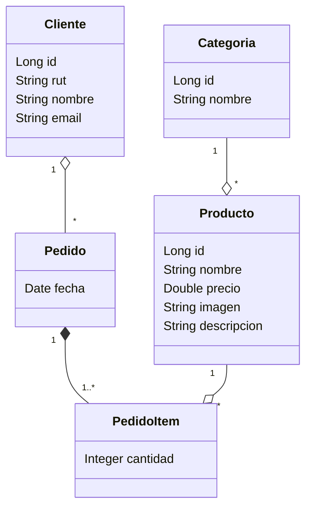

# Conceptual Model

```mermaid
classDiagram
    Categoria "1" --o "*" Producto
    Cliente "1" o-- "*" Pedido
    Pedido "1" *-- "1..*" PedidoItem
    Producto "1" --o "*" PedidoItem

    class Categoria {
        Long id 
        String nombre 
    }    
    class Producto {
        Long id 
        String nombre 
        Double precio 
        String imagen 
        String descripcion         
    }
    class Cliente {
        Long id 
        String rut 
        String nombre 
        String email 
    }
    class Pedido {
        Date fecha 
    }
    class PedidoItem {
        Integer cantidad
    }

```