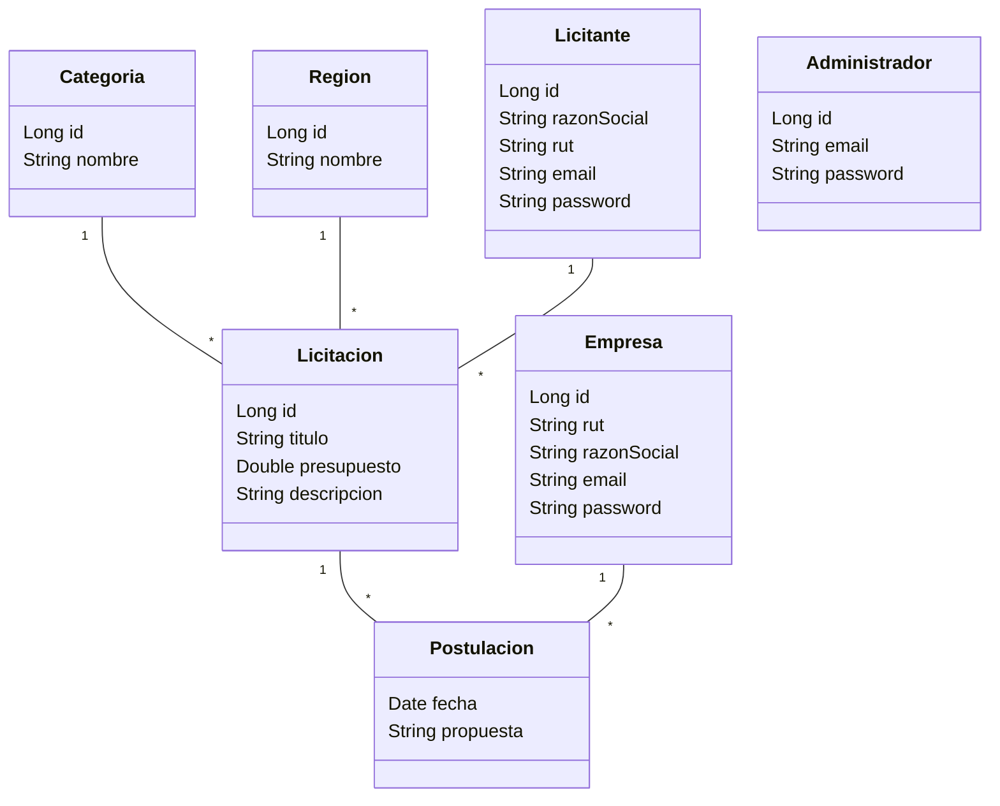
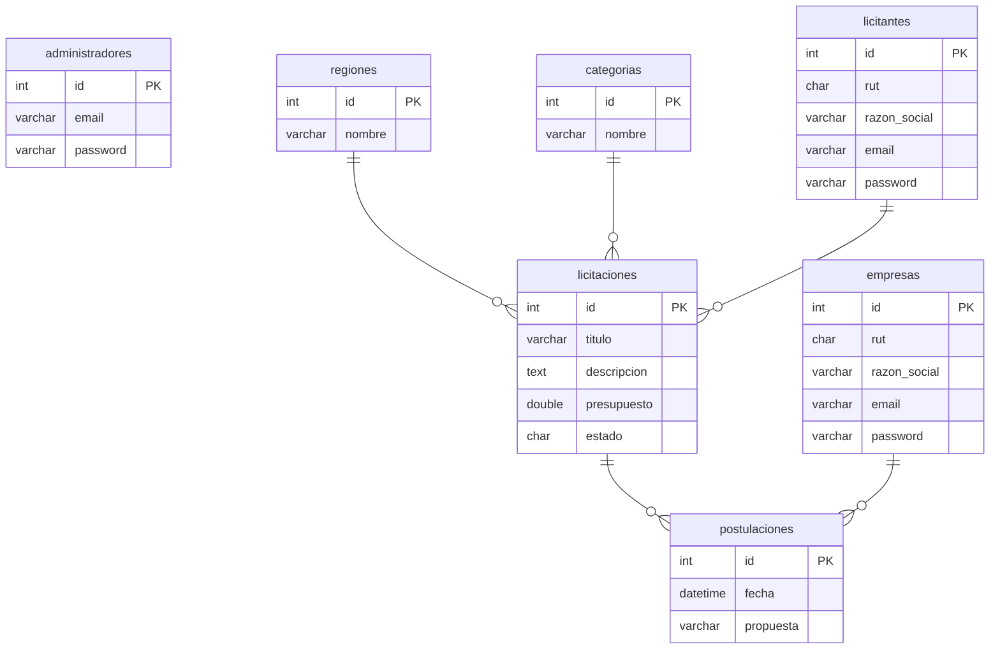

# Caso Licitaciones

## Recomendaciones Generales 

- Trabajar en repositorio Github 

## Modelo Conceptual



## Modelo Entidad Relación



## Iniciar proyecto 

```bash
jruby -S rails new licitaciones --database=mysql 
cd licitaciones 
jruby -S rails db:create 
```

## Iniciar servidor 

```bash
jruby -S rails server 
```

## Devise 

Edita el **Gemfile**:
``` 
gem 'devise', '~> 4.8', '>= 4.8.1'
```

### instala usando **bundle**
```bash
jruby -S bundle install 
```

### instala los archivos en el proyecto con **generate**:
```bash
jruby -S rails generate devise:install
```

### configura devise

**config/environments/development.rb**:
```ruby
config.action_mailer.default_url_options = { host: 'localhost', port: 3000 }
```

### asegúrate de tener configurada una ruta raíz

Define la ruta raíz (**root**)
```ruby
Rails.application.routes.draw do
  root to: "sites#index"
end
```

### edita el layout 

**app/views/layouts/application.html.erb**:
```erb
...
<p class="notice"><%= notice %></p>
<p class="alert"><%= alert %></p>
...
```

### genera las vistas de **devise** para poder personalizar:

```bash
jruby -S rails generate devise:views
```

### Configura inflections si trabajas en **español**:

**config/initializers/inflections.rb**:
```ruby
ActiveSupport::Inflector.inflections(:en) do |inflect|
  inflect.irregular 'administrador', 'administradores'
  inflect.irregular 'region', 'regiones'
  inflect.irregular 'categoria', 'categorias'
  inflect.irregular 'licitante', 'licitantes'
  inflect.irregular 'licitacion', 'licitaciones'
  inflect.irregular 'empresa', 'empresas'
  inflect.irregular 'postulacion', 'postulaciones'
end
```

### Genera los modelos que podrán autenticarse

```bash
jruby -S rails g devise Administrador 
jruby -S rails g devise Empresa 
jruby -S rails g devise Licitante  
```


## Crea los modelos 

Ref: https://guides.rubyonrails.org/v3.2/migrations.html#supported-types

```bash
rails g model Region nombre
rails g model Categoria nombre
rails g model Licitacion titulo descripcion presupuesto:integer categoria:references licitante:references region:references 
rails g model Postulacion propuesta empresa:references licitacion:references 
```

### perfecciona los modelos 

```ruby

```

## datos iniciales 

**db/seeds.rb**:

```ruby
# https://www.bcn.cl/siit/nuestropais/regiones
Region.create([
    {nombre: "Región de Arica y Parinacota"},
    {nombre: "Región de Tarapacá"},
    {nombre: "Región de Antofagasta"},
    {nombre: "Región de Atacama"},
    {nombre: "Región de Coquimbo"},
    {nombre: "Región de Valparaíso"},
    {nombre: "Región del Libertador General Bernardo OHiggins"},
    {nombre: "Región del Maule"},
    {nombre: "Región del Ñuble"},
    {nombre: "Región del Biobío"},
    {nombre: "Región de La Araucanía"},
    {nombre: "Región de Los Ríos"},
    {nombre: "Región de Los Lagos"},
    {nombre: "Región de Aysén del G. Carlos Ibañez del Campo"},
    {nombre: "Región de Magallanes y de la Antártica Chilena"},
    {nombre: "Región Metropolitana de Santiago"},
])
```


