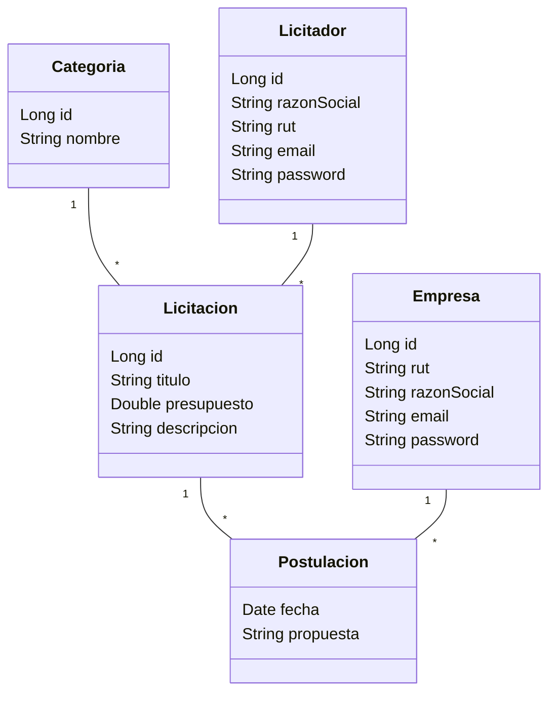

# Caso Licitaciones

## Modelo Conceptual

```mermaid
classDiagram
    Categoria "1" -- "*" Licitacion
    Licitacion "1" -- "*" Postulacion
    Licitador "1" -- "*" Licitacion 
    Empresa "1" -- "*" Postulacion

    class Categoria {
        Long id 
        String nombre 
    }
    class Licitador {
        Long id 
        String razonSocial
        String rut 
        String email 
        String password
    }
    class Licitacion {
        Long id 
        String titulo 
        Double presupuesto 
        String descripcion 
    }
    class Empresa {
        Long id 
        String rut 
        String razonSocial 
        String email 
        String password 
    }
    class Postulacion {
        Date fecha 
        String propuesta 
    }  
```

